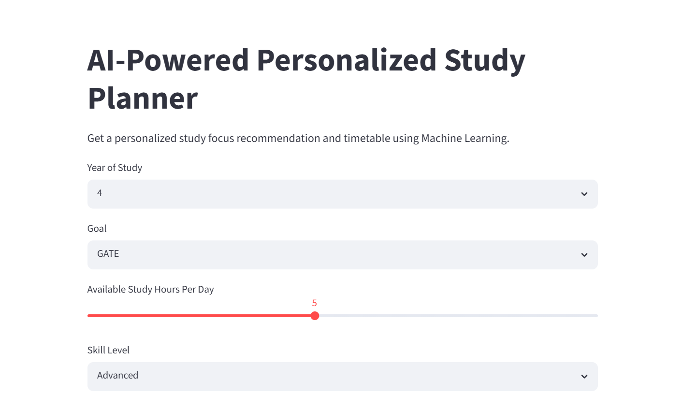
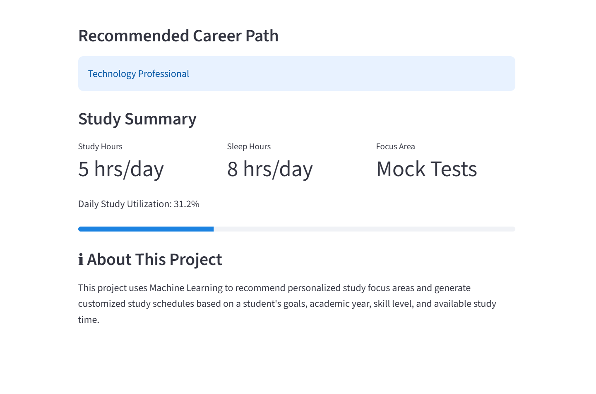
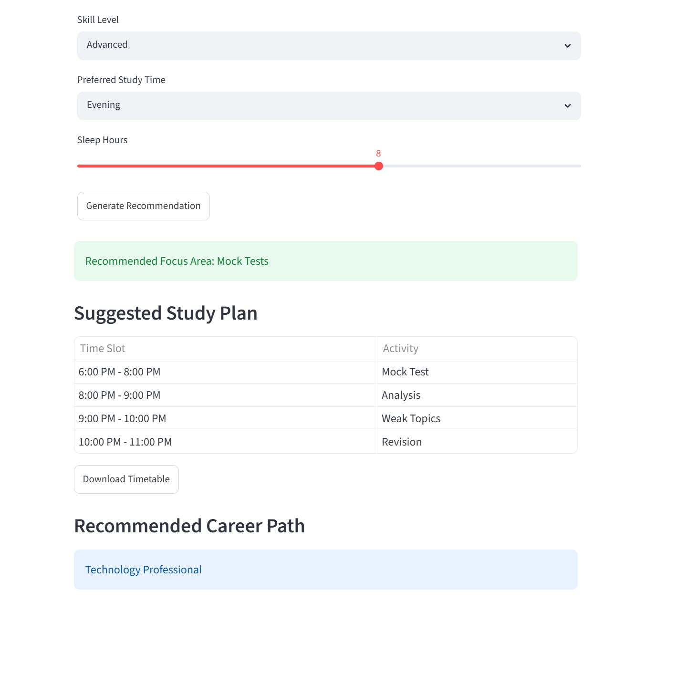
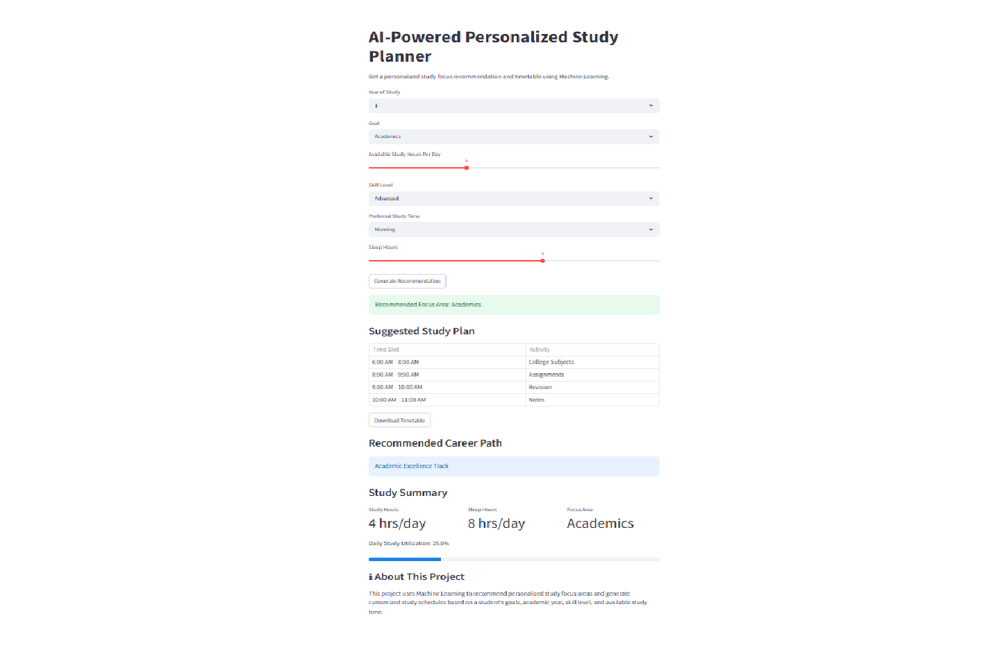

# AI-Powered Personalized Study Planner

## Overview

The AI-Powered Personalized Study Planner is a machine learning-based application designed to help students organize their learning activities more effectively. The system recommends an appropriate study focus area based on a student's academic year, career goal, available study hours, and skill level. It then generates a personalized timetable to support structured and goal-oriented learning.

This project demonstrates the practical application of machine learning in educational planning and personalized recommendations.

---

## Project Links

### GitHub Repository

https://github.com/Vineeshakolla/AI-Personalized-Study-Planner

### Live Application

https://ai-personalized-study-planner.streamlit.app/

---

## Problem Statement

Students often struggle to allocate their study time efficiently while preparing for different goals such as placements, machine learning, research, competitive programming, GATE, and higher studies.

A generic study plan may not address individual learning requirements, available time, or skill levels. This project aims to provide personalized study recommendations by analyzing student-specific information and generating a customized study plan.

---

## Features

* Personalized study focus recommendation
* Machine learning-based prediction system
* Dynamic timetable generation
* Career path recommendations
* Downloadable timetable in CSV format
* Interactive web application built with Streamlit
* Cloud deployment using Streamlit Community Cloud

---

## Screenshots

### Home Page



### Recommendation Output



### Generated Study Timetable



### Live Application



---

## Machine Learning Workflow

### Input Features

* Academic Year
* Career Goal
* Available Study Hours per Day
* Skill Level

### Output

The model predicts a suitable focus area such as:

* Data Structures and Algorithms (DSA)
* Machine Learning Foundations
* Machine Learning Projects
* Deep Learning
* Research
* Competitive Programming
* Core Subjects
* Mock Test Preparation
* GRE Preparation

Based on the predicted focus area, a personalized timetable is generated.

---

## Machine Learning Model

The recommendation engine is built using the Random Forest Classifier from Scikit-Learn.

Categorical variables are converted into numerical values using Label Encoding before model training. The trained model and encoders are stored using Joblib and loaded during application execution.

---

## Technologies Used

### Programming Language

* Python

### Libraries and Frameworks

* Pandas
* NumPy
* Scikit-Learn
* Streamlit
* Joblib

---

## Project Structure

```text
AI-Personalized-Study-Planner
│
├── app.py
├── train_model.py
├── timetable_generator.py
├── requirements.txt
├── README.md
│
├── dataset
│   └── student_dataset.csv
│
├── model
│   ├── study_planner.pkl
│   ├── goal_encoder.pkl
│   ├── skill_encoder.pkl
│   └── focus_encoder.pkl
│
└── screenshots
    ├── home_page.png
    ├── prediction_result.png
    ├── timetable_output.png
    └── deployed_app.png
```

---

## Installation

### Clone the Repository

```bash
git clone https://github.com/Vineeshakolla/AI-Personalized-Study-Planner.git
cd AI-Personalized-Study-Planner
```

### Create a Virtual Environment

```bash
python -m venv venv
```

### Activate the Environment

Windows:

```bash
venv\Scripts\activate
```

### Install Dependencies

```bash
pip install -r requirements.txt
```

---

## Running the Application

```bash
streamlit run app.py
```

The application will launch in your browser.

---

## Example Workflow

1. Select your academic year.
2. Choose your primary goal.
3. Specify available study hours.
4. Select your skill level.
5. Generate a recommendation.
6. View the predicted focus area.
7. Review the personalized timetable.
8. Download the timetable if required.

---

## Deployment

The application is deployed using Streamlit Community Cloud and can be accessed through the live application link provided above.

---

## Future Improvements

* Expanding the training dataset
* Incorporating additional student attributes
* Weekly and monthly timetable generation
* Progress tracking dashboard
* Performance analytics
* AI-powered study assistant
* Enhanced recommendation accuracy through larger datasets

---

## Conclusion

This project demonstrates how machine learning can be applied to educational planning by providing personalized recommendations and structured study schedules. The application combines predictive modeling with an interactive user interface to create a practical learning support tool for students.

---

## Author

**Vineesha Kolla**

B.Tech Computer Science Student

Interested in Machine Learning, Artificial Intelligence, and Software Development.
Email: kollavineesha@gmail.com
